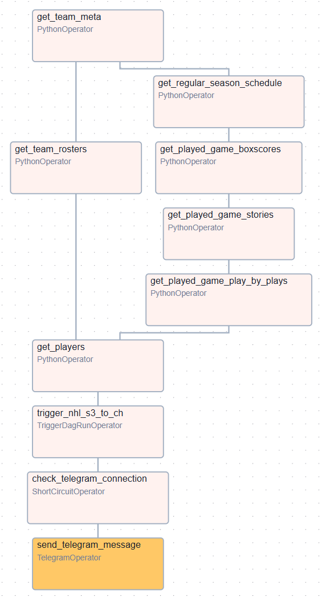
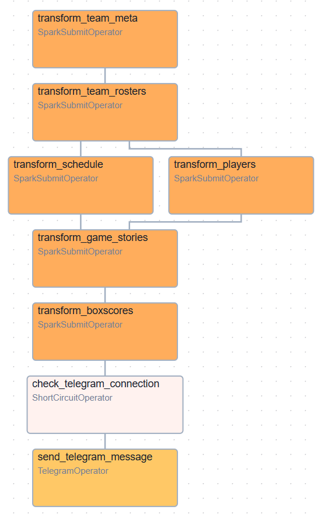

# NHL Data Saver


End-to-end ETL/ELT пайплайн, демонстрирующий работу с API-источником, S3-хранилищем,
Spark-трансформациями и распределённым ClickHouse:
- на ежедневной основе выгружает данные из официального API Национальной Хоккейной Лиги и сохраняет их в S3-хранилище
- производит трансформацию данных в Spark и сохраняет их в ClickHouse

<!-- TOC -->
# Оглавление
* [Архитектура и технологический стек](#архитектура-и-технологический-стек)
* [Структура проекта](#структура-проекта)
* [Запуск](#запуск)
* [Описание DAG'ов](#описание-dagов)
  * [nhl_api_to_s3](#nhl_api_to_s3)
  * [nhl_s3_to_ch](#nhl_s3_to_ch)
* [Таблицы Clickhouse](#таблицы-clickhouse)
* [Ограничения](#ограничения)
<!-- TOC -->

## Архитектура и технологический стек
- `NHL API` - официальный API НХЛ
- `Docker`  - контейнеризация сервисов пайплана
- `Airflow` - оркестрация пайплайна/ управление расписанием
- `MinIO` - файловое S3-хранилище, используется для хранения сырых данных в формате .parquet
- `Apache Spark` - трансформация сырых данных
- `ClickHouse` - СУБД для хранения трансформированных и очищенных данных; 2 шарда по 2 реплики
- `Jupyter Lab` - исследование данных и отладка кода

## Структура проекта
```angular2html
nhl-data-saver/
├── clickhouse_configs/ # Конфиги для Clickhouse
├── dags/               # DAG'и
├── images/             # Медиа для README
├── jupyter/            # Исследование и отладка кода
├── src /               # Общие сервисы и утилиты
│   ├── scripts/        # Скрипты трансформации для Spark
│   ├── services/       # Кастомные классы
```

## Запуск
1. Клонировать репозиторий и перейти в папку с ним
2. Запустить команду `docker compose up -d`
3. (Опционально) Для получения нотификаций в Telegram настроить в Airflow Connection:
   - Connection Id: `telegram_default`
   - Host: ID пользователя/чата, куда будет приходить нотификация
   - Password: токен бота, от которого будет приходить нотификация

## Описание DAG'ов
### nhl_api_to_s3
Выгружает данные из NHL API и сохраняет их в S3. Работает по крону `0 7 * * *` 



1. `get_team_meta`
   - получает метаданные команд (идентификаторы и полные названия)
   - повторно не сохраняет данные, если они уже есть в S3
2. `get_regular_season_schedule` 
   - получает календарь игр регулярного сезона
   - повторно не сохраняет календарь для прошедших периодов
3. `get_team_rosters`
   - получает текущие составы команд
4. `get_played_game_boxscores`
   - получает персональную статистику игроков за матч
   - сохраняет информацию только по тем завершенным матчам, которые не были сохранены до этого
5. `get_played_game_stories`
   - получает и результат игры и командную статистику за матч
   - сохраняет информацию только по тем завершенным матчам, которые не были сохранены до этого
6. `get_played_game_play_by_plays`
   - получает составы команд на игру и детализацию по всем игровым событиям
   - сохраняет информацию только по тем завершенным матчам, которые не были сохранены до этого
7. `get_players`
   - получает персональную информацию игроков
8. `trigger_nhl_s3_to_ch`
   - запускает DAG `nhl_s3_to_ch` (описан ниже)
9. `check_telegram_connection`
   - проверяет, существует ли коннекшен `telegram_default`
10. `send_telegram_message`
    - отправляет в Telegram нотификацию об успешном завершении DAG'а, если в предыдущем пункте получен положительный результат проверки

Таски внутри DAG'а в основном выполняются последовательно, так как источник накладывает жесткие `rate limits`, что неизбежно приводит к получению HTTP-ошибки `429 Too Many Requests`

### nhl_s3_to_ch
Читает сырые данные из S3, трансформирует и перекладывает их в ClickHouse. Запускается по триггеру в DAG'е `nhl_api_to_s3`



1. `transform_team_meta`
   - трансформирует метаданные команд, дополняя их информацией о конференции и дивизионе, к которым относятся команды
   - сохраняет данные в таблицу team_meta (только если данных в ней еще нет)
2. `transform_team_rosters`
   - трансформирует текущие составы команд
   - сохраняет данные в таблицу team_rosters (не хранит историчность составов)
3. `transform_schedule`
   - трансформирует календарь игр
   - сохраняет данные в таблицу schedule по играм, которые:
     - были завершены, но еще не сохранены
     - не завершены (будущие игры)
4. `transform_players`
   - трансформирует персональную информацию игроков
   - сохраняет данные в таблицу players
5. `transform_game_stories`
   - трансформирует результат игры и командную статистику за матч
   - сохраняет данные в таблицу game_results и team_game_stats по играм, которые были завершены, но еще не были сохранены
6. `transform_boxscores`
   - трансформирует персональную статистику игроков за матч
   - сохраняет данные в таблицу skater_game_stats и goalie_game_stats по играм, которые были завершены, но еще не были сохранены
7. `check_telegram_connection`
   - проверяет, существует ли коннекшен `telegram_default`
8. `send_telegram_message`
   - отправляет в Telegram нотификацию об успешном завершении DAG'а, если в предыдущем пункте получен положительный результат проверки

Таски внутри DAG'а в основном выполняются последовательно из-за ограничений ресурсов локальной машины

## Таблицы ClickHouse

| Название таблицы  | Описание                                                                           | Используемые движки                        |
|-------------------|------------------------------------------------------------------------------------|--------------------------------------------|
| team_meta         | информация о командах                                                              | ReplicatedReplacingMergeTree + Distributed |
| team_rosters      | текущие составы команд                                                             | ReplicatedMergeTree + Distributed          |
| schedule          | календарь игр                                                                      | ReplicatedReplacingMergeTree + Distributed |
| players           | игроки                                                                             | ReplicatedReplacingMergeTree + Distributed |
| game_results      | результаты игр (счет, 3 звезды матча, информация о голах)                          | ReplicatedMergeTree + Distributed          |
| team_game_stats   | статистика команд за матч (кол-во голов, очков, бросков и т.д.)                    | ReplicatedMergeTree + Distributed          |
| skater_game_stats | статистика полевых игроков за матч (кол-во голов, голевых передач, очков и т.д.)   | ReplicatedMergeTree + Distributed          |
| goalie_game_stats | статистика голкиперов за матч (кол-во отраженных бросков, пропущенных шайб и т.д.) | ReplicatedMergeTree + Distributed          |

На основе данных таблиц можно формировать агрегирующие данные. Например, турнирную таблицу команд с показателями
команд за сезон или таблицы лидеров среди игроков и голкиперов. Дополнительно можно высчитывать такие специфические показатели,
как ожидаемое количество побед, голов и пр.

## Ограничения

1. Данные из источника собираются только за регулярную часть сезона 2025/26
2. Логика пайплайна не привязана к `logical_date`; данные из источника всегда возвращаются на текущий момент времени
3. Docker-инфраструктура потребляет 10-13 ГБ RAM (не включая процессы ОС и прочие процессы, запущенные на локальной машине) и 35-40 ГБ дискового пространства 
4. Настройка дашбордов и агрегирующей аналитической отчетности не входит в скоуп проекта